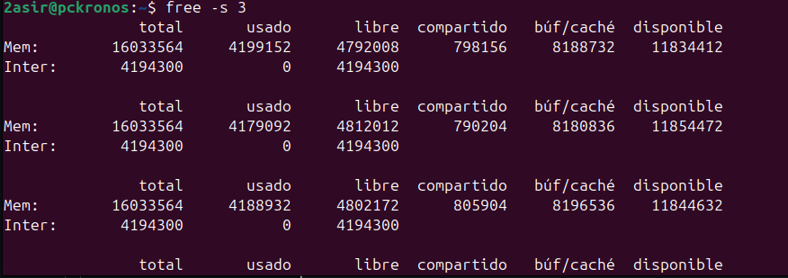
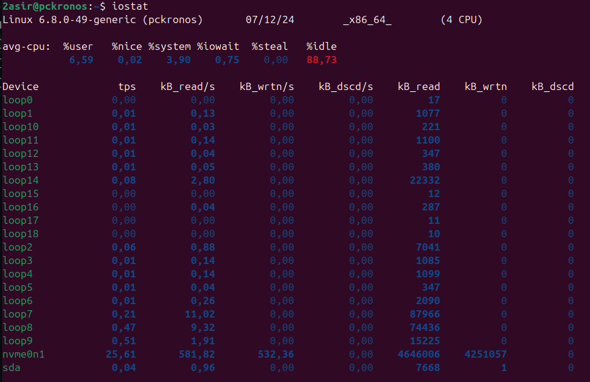
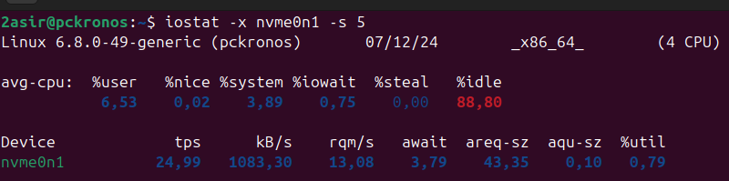

# COMANDO FREE 

El comando free en sistemas basados en Unix (como Linux) se utiliza para mostrar información sobre el uso de la memoria en el sistema, incluyendo la memoria RAM y la memoria swap. Es una herramienta simple pero útil para obtener una visión general de la cantidad de memoria libre, utilizada y compartida en el sistema.

Comando `free -h` :

Comando `free -s 3` :

# COMANDO PARA VER EL ESPACIO 

Comando `df -hT` :

Comando `du -hs` :

Comando `sudo du -h --max-depth=1 /home/` :

# COMANDO PARA VER LAS CARACTERISTICAS DE CPU 

Comando `iostat` :

Comando en intervalos de 5 segundos `iostat -x nvme0n1 -s 5` : 

