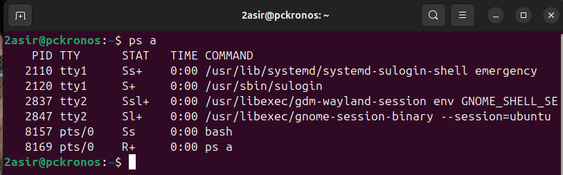
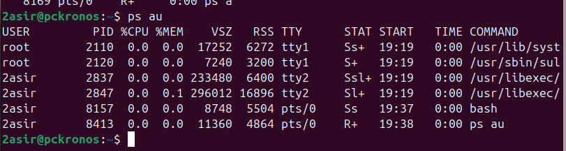
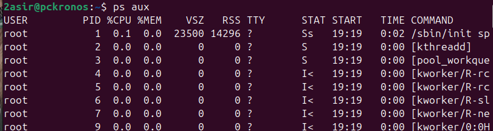
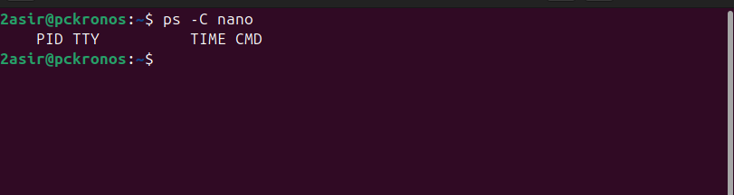
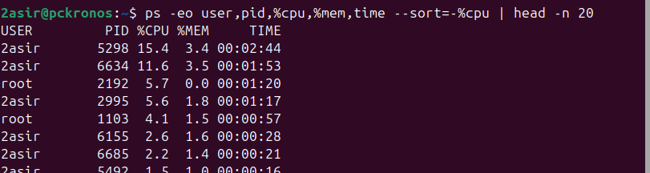
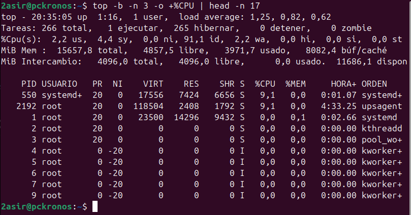
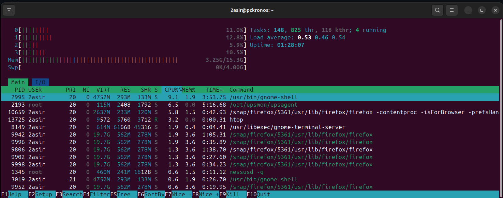

# COMANDO PS 

El comando PS nos muestra imformacion sobre los procesos. 

```bash	
ps a
```

```bash	
ps au
```

```bash	
ps aux
```

 ```bash
 ps -C nano
 ```



Si quieres ver los 5 que mas ocupan memoria, puedes usar 

`ps -eo user,pid,%cpu,%mem,time --sort=-%cpu | head -n 6`


# COMANDO TOP
El comando top permite ver en tiempo real los procesos que están ejecutándose en el sistema. Proporciona información sobre el uso de los recursos del sistema, como la CPU, la memoria y el espacio de intercambio (swap).
## DISTINTAS OPCIONES QUE PODEMOS USAR DE ESTE COMNADO 

`P`: Ordenar los procesos por uso de CPU.

`M`: Ordenar los procesos por uso de memoria.

`T`: Ordenar los procesos por el tiempo de ejecución.

`k`: Matar un proceso. Se necesita el PID del proceso.

`r`: Cambiar la prioridad (renice) de un proceso.

`q`: Salir de top.

`h`: Mostrar la ayuda (teclas y opciones disponibles dentro de top).

`z`: Cambiar la coloración de la interfaz.

`c`: Alternar entre mostrar el comando completo o el nombre del proceso.


`top -b -n 3 -o +%CPU | head -n 17` nos muestra los 10 procesos que más CPU consumen cada 3 segundos



# HTOP 
htop es una herramienta interactiva y visual para monitorear el rendimiento de un sistema en tiempo real, similar a top, pero con una interfaz más amigable y con funcionalidades adicionales. Está disponible en sistemas Linux y otros sistemas operativos basados en Unix.

## ATAJOS
`F1`: Mostrar ayuda (teclas de acceso rápido disponibles).

`F2`: Configurar la interfaz (personalizar la visualización).

`F3`: Buscar un proceso por nombre.

`F4`: Filtrar procesos (ingresa un patrón para filtrar los procesos).

`F5`: Mostrar los procesos en forma de árbol (para ver las relaciones padre-hijo).

`F6`: Cambiar el criterio de ordenación de los procesos.

`F7`: Disminuir la prioridad (renice) de un proceso.

`F8`: Aumentar la prioridad (renice) de un proceso.

`F9`: Matar un proceso (terminar el proceso seleccionado)

`F10`: Salir de htop.

Utilizacion `htop` :


# ATOP

El comando atop es una herramienta avanzada de monitoreo de sistemas en tiempo real para Linux, similar a top y htop, pero con características adicionales y más detalladas. Permite realizar un seguimiento exhaustivo de los recursos del sistema, como la CPU, la memoria, el disco y la red, proporcionando un análisis más profundo y preciso del rendimiento del sistema.

Utilizacion `atop` :


