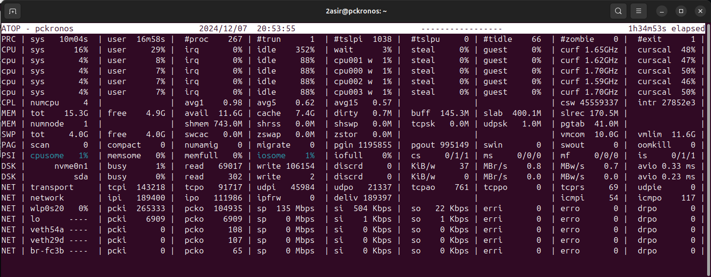
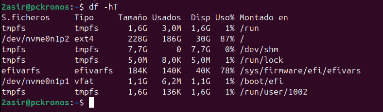
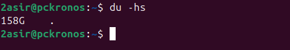

# COMANDO PS 

El comando PS nos muestra imformacion sobre los procesos. 

```bash	
ps a
```

```bash	
ps au
```

```bash	
ps aux
```

 ```bash
 ps -C nano
 ```


Si quieres ver los 5 que mas ocupan memoria, puedes usar 

`ps -eo user,pid,%cpu,%mem,time --sort=-%cpu | head -n 6`


# COMANDO TOP
El comando top permite ver en tiempo real los procesos que están ejecutándose en el sistema. Proporciona información sobre el uso de los recursos del sistema, como la CPU, la memoria y el espacio de intercambio (swap).
## DISTINTAS OPCIONES QUE PODEMOS USAR DE ESTE COMNADO 

`P`: Ordenar los procesos por uso de CPU.

`M`: Ordenar los procesos por uso de memoria.

`T`: Ordenar los procesos por el tiempo de ejecución.

`k`: Matar un proceso. Se necesita el PID del proceso.

`r`: Cambiar la prioridad (renice) de un proceso.

`q`: Salir de top.

`h`: Mostrar la ayuda (teclas y opciones disponibles dentro de top).

`z`: Cambiar la coloración de la interfaz.

`c`: Alternar entre mostrar el comando completo o el nombre del proceso.


`top -b -n 3 -o +%CPU | head -n 17` nos muestra los 10 procesos que más CPU consumen cada 3 segundos


# HTOP 
htop es una herramienta interactiva y visual para monitorear el rendimiento de un sistema en tiempo real, similar a top, pero con una interfaz más amigable y con funcionalidades adicionales. Está disponible en sistemas Linux y otros sistemas operativos basados en Unix.

## ATAJOS
`F1`: Mostrar ayuda (teclas de acceso rápido disponibles).

`F2`: Configurar la interfaz (personalizar la visualización).

`F3`: Buscar un proceso por nombre.

`F4`: Filtrar procesos (ingresa un patrón para filtrar los procesos).

`F5`: Mostrar los procesos en forma de árbol (para ver las relaciones padre-hijo).

`F6`: Cambiar el criterio de ordenación de los procesos.

`F7`: Disminuir la prioridad (renice) de un proceso.

`F8`: Aumentar la prioridad (renice) de un proceso.

`F9`: Matar un proceso (terminar el proceso seleccionado)

`F10`: Salir de htop.

Utilizacion `htop` :


# ATOP

El comando atop es una herramienta avanzada de monitoreo de sistemas en tiempo real para Linux, similar a top y htop, pero con características adicionales y más detalladas. Permite realizar un seguimiento exhaustivo de los recursos del sistema, como la CPU, la memoria, el disco y la red, proporcionando un análisis más profundo y preciso del rendimiento del sistema.

Utilizacion `atop` :



# COMANDO FREE 

El comando free en sistemas basados en Unix (como Linux) se utiliza para mostrar información sobre el uso de la memoria en el sistema, incluyendo la memoria RAM y la memoria swap. Es una herramienta simple pero útil para obtener una visión general de la cantidad de memoria libre, utilizada y compartida en el sistema.


Comando `free -h` :


Comando `free -s 3` :


# COMANDO PARA VER EL ESPACIO 

Comando `df -hT` :



Comando `du -hs` :



Comando `sudo du -h --max-depth=1 /home/` :


# COMANDO PARA VER LAS CARACTERISTICAS DE CPU 

Comando `iostat` :


Comando `iostat -x` : 


Comando en intervalos de 5 segundos `iostat -x nvme0n1 -s 5` : 


# MONITORIZACION EN RED 

# TCPDUMP
TCPDUMP es una herramienta de línea de comandos utilizada para capturar y analizar el tráfico de red en tiempo real. Es ampliamente utilizada en administración de redes, pruebas de seguridad y resolución de problemas. Permite observar los paquetes de datos que se envían y reciben a través de una red, lo que puede ayudar a identificar problemas de conectividad, analizar protocolos de red, detectar posibles intrusiones o realizar auditorías de tráfico.

Comando `tcpdump` :


## CON MI TARJETA DE RED 

Comando `tcpdump -i wlp0s20f3` :


## A UN ARCHIVO

Comando `sudo tcpdump -i wlp0s20f3 -w capturas` :


Comando `tcpdump -r` para hacerlo en modo lectura

# TCPTRACK

TCPTRACK es una herramienta de monitoreo de conexiones TCP en tiempo real. Está diseñada para mostrar información detallada sobre las conexiones TCP activas en un sistema, como el estado de cada conexión, los puertos involucrados, la cantidad de datos enviados y recibidos, entre otros detalles. A diferencia de otras herramientas como netstat o ss, que pueden ofrecer información más general sobre las conexiones de red, tcptrack se enfoca en proporcionar una visualización en tiempo real y fácil de leer de las conexiones TCP activas.

Comando `tcptrack -i wlp0s20f3` :


# IPTRAF

IPTRAF es una herramienta de monitoreo de tráfico de red para sistemas Linux. Es una aplicación de línea de comandos que permite visualizar y analizar el tráfico de red en tiempo real, proporcionando estadísticas detalladas sobre las conexiones de red activas, como la cantidad de datos transmitidos, los puertos de origen y destino, direcciones IP, entre otros.

## INSTALACIÓN

Para instalarlo usamos el comando `sudo apt install iptraf-ng`:


# BMON

BMON (Bandwidth Monitor) es una herramienta de monitoreo de ancho de banda en tiempo real para sistemas Linux. Es una herramienta ligera y de línea de comandos que permite monitorear el uso del ancho de banda de las interfaces de red, proporcionando estadísticas detalladas sobre la cantidad de datos transmitidos y recibidos a través de las interfaces de red de un sistema.

La ventaja de bmon es que proporciona una vista clara y visual del uso de la red, con gráficos simples en texto que pueden mostrar el tráfico de red en tiempo real de manera eficiente. Es especialmente útil para los administradores de sistemas que necesitan monitorear el rendimiento de la red sin recurrir a herramientas más complejas.

# INSTALACIÓN 

Para instalarlo usamos el comando `sudo apt install bmon`:


