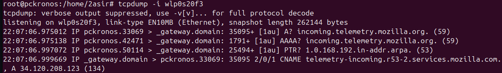
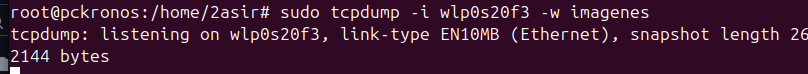
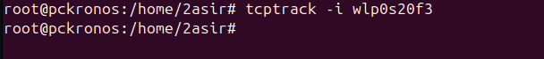
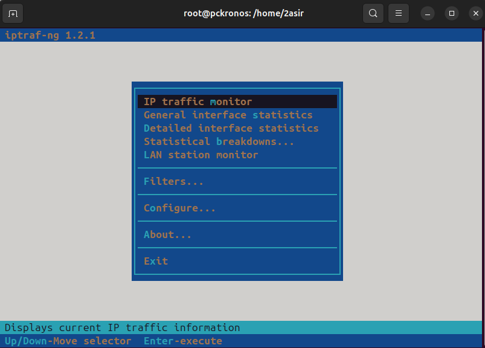
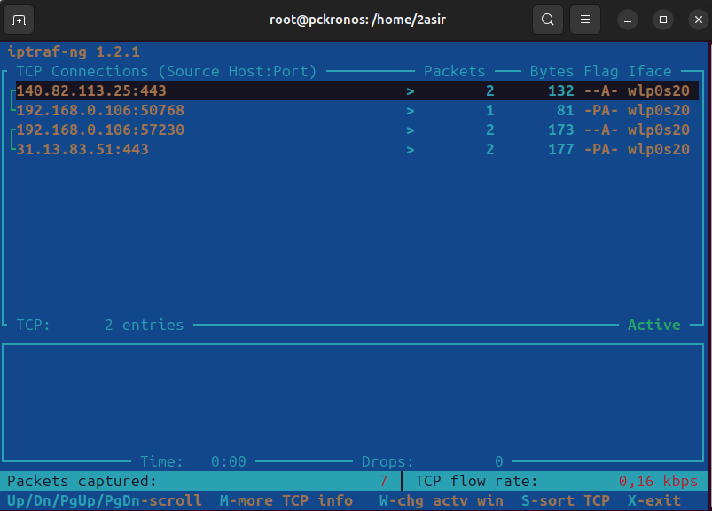
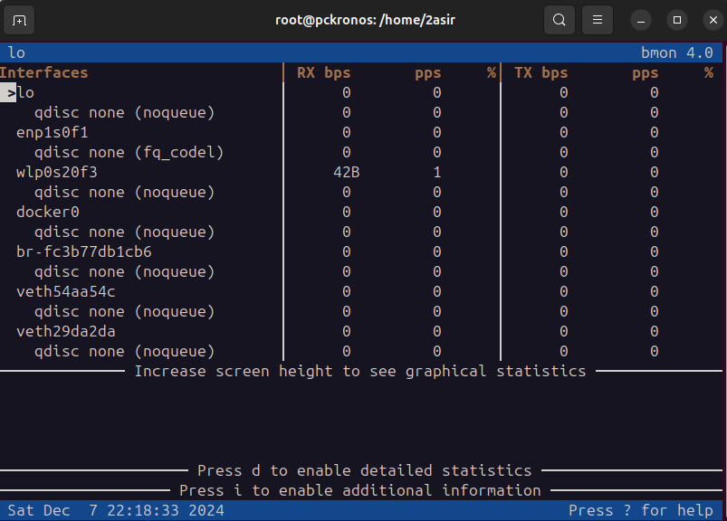

# MONITORIZACION EN RED 

# TCPDUMP
TCPDUMP es una herramienta de línea de comandos utilizada para capturar y analizar el tráfico de red en tiempo real. Es ampliamente utilizada en administración de redes, pruebas de seguridad y resolución de problemas. Permite observar los paquetes de datos que se envían y reciben a través de una red, lo que puede ayudar a identificar problemas de conectividad, analizar protocolos de red, detectar posibles intrusiones o realizar auditorías de tráfico.

Comando `tcpdump` :

## CON MI TARJETA DE RED 

Comando `tcpdump -i wlp0s20f3` :

## A UN ARCHIVO

Comando `sudo tcpdump -i wlp0s20f3 -w capturas` :

Comando `tcpdump -r` para hacerlo en modo lectura

# TCPTRACK

TCPTRACK es una herramienta de monitoreo de conexiones TCP en tiempo real. Está diseñada para mostrar información detallada sobre las conexiones TCP activas en un sistema, como el estado de cada conexión, los puertos involucrados, la cantidad de datos enviados y recibidos, entre otros detalles. A diferencia de otras herramientas como netstat o ss, que pueden ofrecer información más general sobre las conexiones de red, tcptrack se enfoca en proporcionar una visualización en tiempo real y fácil de leer de las conexiones TCP activas.

Comando `tcptrack -i wlp0s20f3` :

# IPTRAF

IPTRAF es una herramienta de monitoreo de tráfico de red para sistemas Linux. Es una aplicación de línea de comandos que permite visualizar y analizar el tráfico de red en tiempo real, proporcionando estadísticas detalladas sobre las conexiones de red activas, como la cantidad de datos transmitidos, los puertos de origen y destino, direcciones IP, entre otros.

## INSTALACIÓN

Para instalarlo usamos el comando `sudo apt install iptraf-ng`:

# BMON

BMON (Bandwidth Monitor) es una herramienta de monitoreo de ancho de banda en tiempo real para sistemas Linux. Es una herramienta ligera y de línea de comandos que permite monitorear el uso del ancho de banda de las interfaces de red, proporcionando estadísticas detalladas sobre la cantidad de datos transmitidos y recibidos a través de las interfaces de red de un sistema.

La ventaja de bmon es que proporciona una vista clara y visual del uso de la red, con gráficos simples en texto que pueden mostrar el tráfico de red en tiempo real de manera eficiente. Es especialmente útil para los administradores de sistemas que necesitan monitorear el rendimiento de la red sin recurrir a herramientas más complejas.

# INSTALACIÓN 

Para instalarlo usamos el comando `sudo apt install bmon`:

