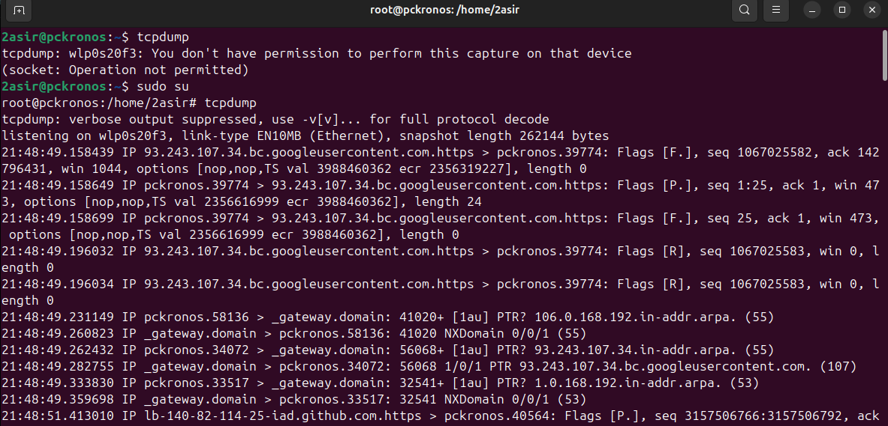
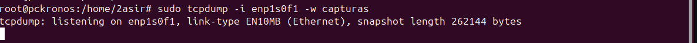
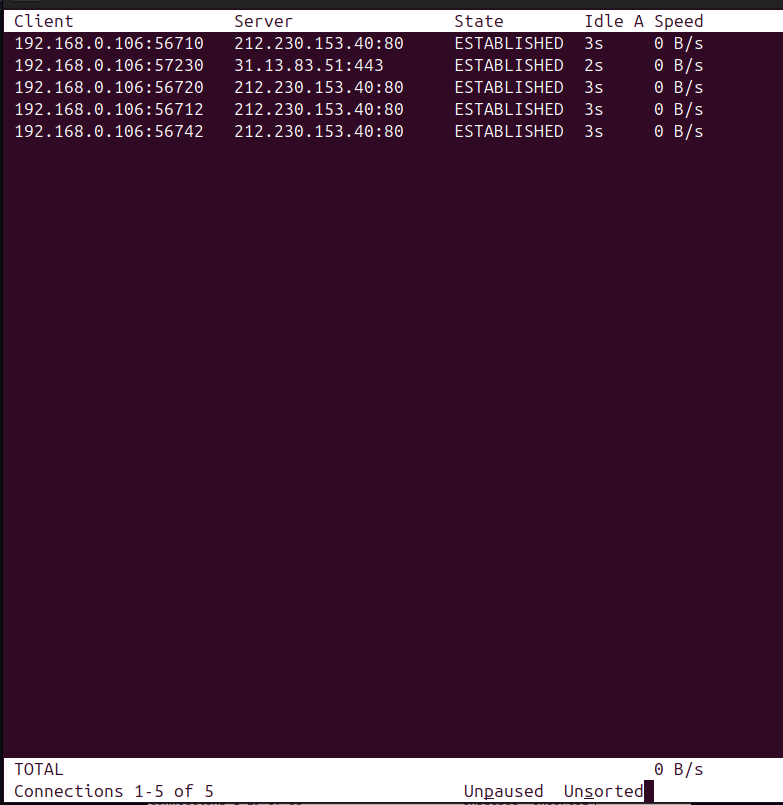

# MONITORIZACION EN RED 
# TCPDUMP

Comando `tcpdump` :

## CON MI TARJETA DE RED 

Comando `tcpdump -i enp1s0f1` :

## A UN ARCHIVO

Comando `sudo tcpdump -i enp1s0f1 -w capturas` :

Comando `tcpdump -r` para hacerlo en modo lectura : 

# TCPTRACK

